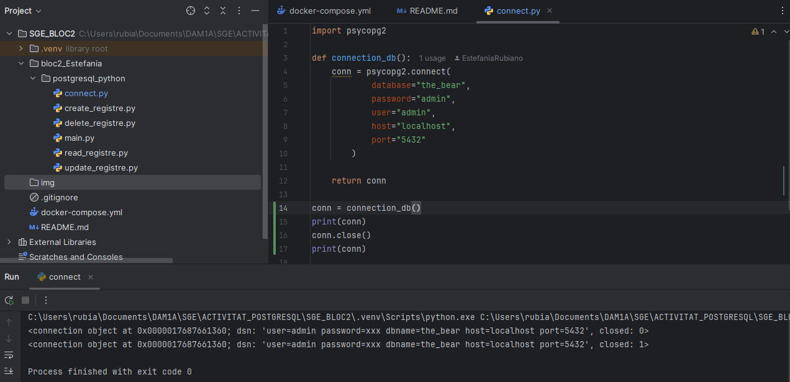
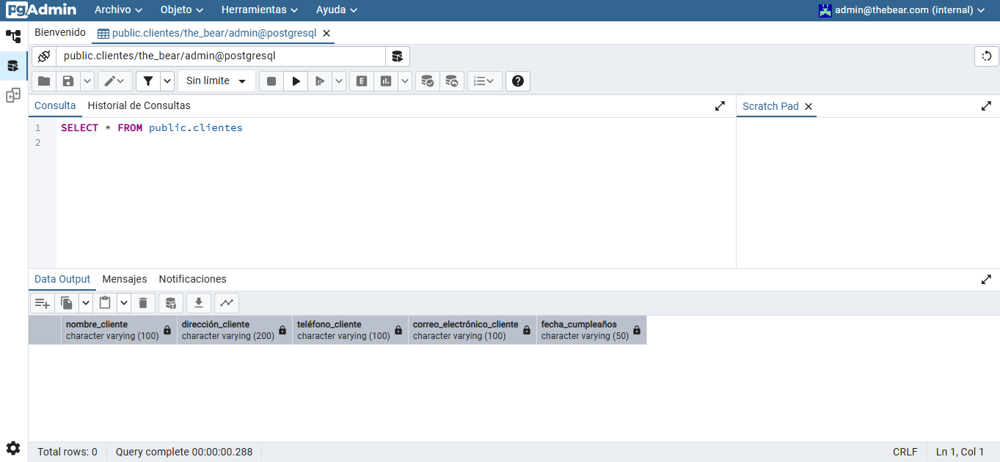
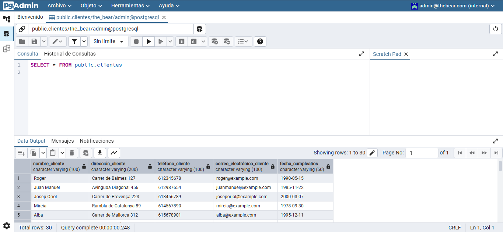
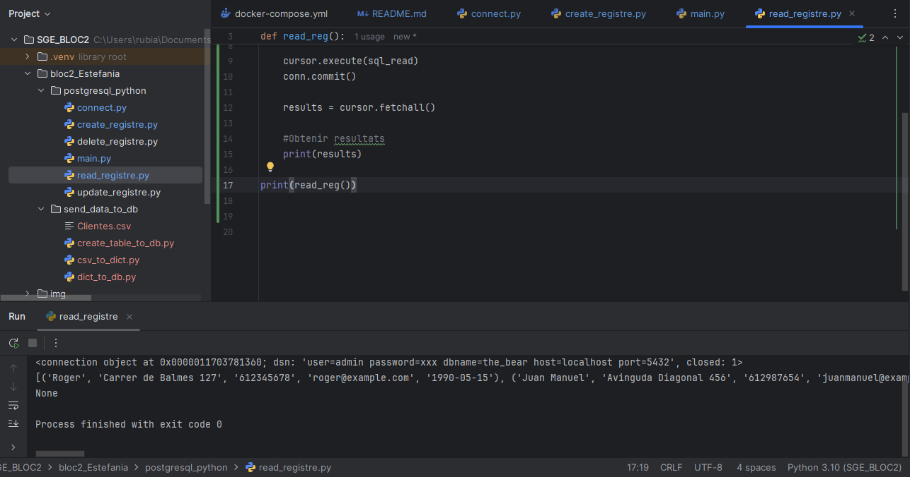
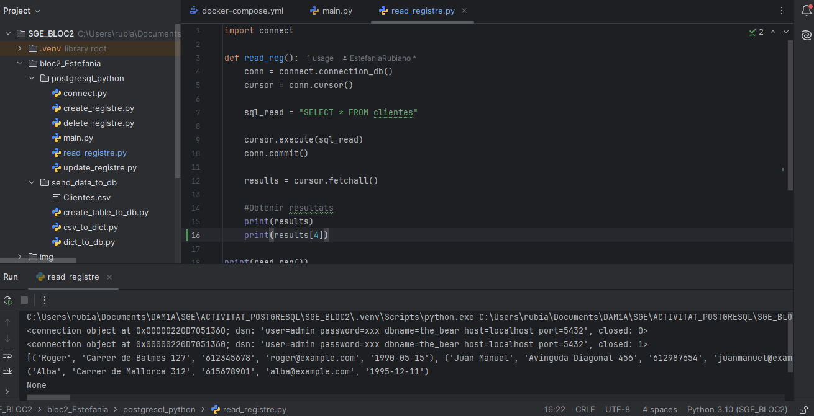
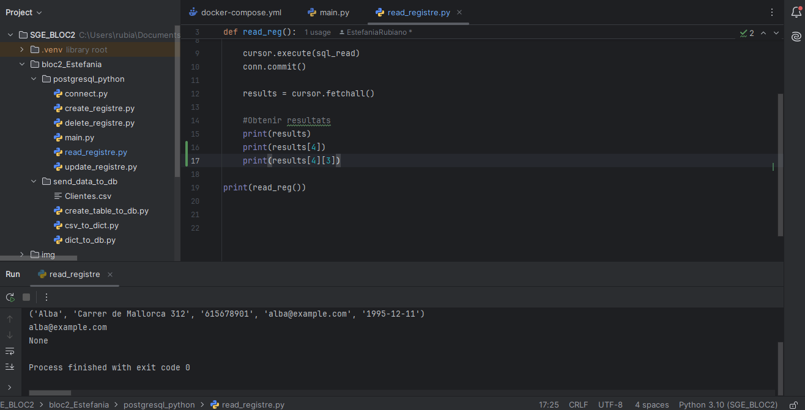
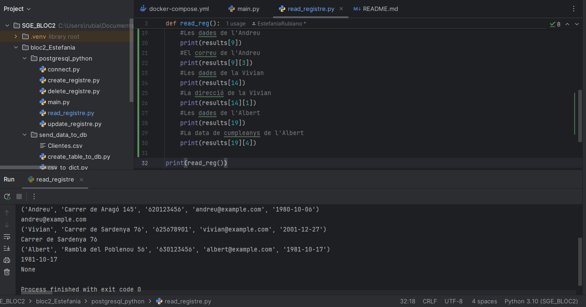

# SGE_BLOC2

## Activitat python+postgresql

### Comprovació connexió

Quan executes **print(conn)**, es mostra un objecte de connexió que indica que la base de dades s'ha connectat correctament. A la sortida apareixen les dades de connexió i l'estat **closed: 0**, cosa que significa que la connexió *està activa*. Després, quan crides **conn.close()**, la connexió *es tanca*. Si tornes a imprimir conn, l'objecte continua existint, però ara apareix amb **closed: 1**, indicant que ja no es pot utilitzar per a consultes.

### Creació taules

L’script ha creat a PostgreSQL la taula Clientes amb les columnes donades.
Si entres a pgadmin i busques a la base de dades the_bear, veuràs la taula creada. Si executes SELECT * FROM Clientes; veuràs que la taula existeix però està buida, ja que només s’ha creat l'estructura sense registres.

### Inserció de dades

En executar el segon arxiu **(csv_to_dict.py)**, s’han llegit les dades del fitxer **Clientes.csv** i s’han inserit els 30 primers registres a la taula Clientes de la base de dades **the_bear**.
Si vas a pgadmin, ara es veu la taula plena amb 30 registres, cadascun amb les dades requerides.

### Creació registre

En executar **main.py**, s’ha afegit un nou client (Roger) a la taula Clientes de la base de dades **the_bear**.

Al pgadmin, es veu que ara hi ha un registre amb les dades que li hem introduit.

## LISTS

### Veure les dades

En executar **read_registre.py**, la terminal mostra tots els clients de la taula **Clientes** en forma de llista. Això confirma que la consulta SELECT * FROM clientes funciona correctament.

### Accedir a determinat registre

Quan executes **print(results[4])**, estàs accedint al cinquè registre de la llista results.
(els índexs de les llistes comencen a comptar des de 0)

### Accedir a determinat camp del registre

Quan s'executa **print(results[4][3])**, estàs accedint al correu electrònic del cinquè client de la base de dades.
**results[4]** selecciona el cinquè registre i
**results[4][3]** agafa el quart camp d'aquest registre, que a la nostra taula és correo_electronico_cliente.

### Consultes varies 

Aquests prints mostren informació específica de diferents clients accedint als seus registres. Primer, recupera totes les dades d'un client en una posició concreta i després extreu un camp específic d'aquest mateix registre, com ara el correu electrònic, la direcció o la data de naixement. A la terminal, es mostrarà primer el registre complet i després la informació detallada segons el camp seleccionat.

